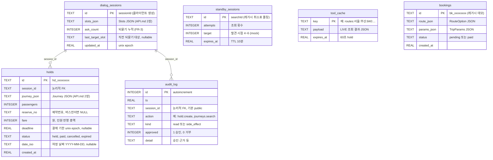

# 바로타 백엔드 DB 스키마 (SQLite · WAL)

| 항목 | 내용 |
| --- | --- |
| 엔진 | SQLite (WAL 모드) — 파일 `barota.db`, 경로는 `BAROTA_DB` 환경변수 |
| 원본 | `app/db.py` `init_db()` — 이 문서와 어긋나면 코드가 기준 |
| JSON 컬럼 타입 | `slots_json`=Slots, `journey_json`=Journey — 필드 정의는 [API.md](API.md) §2 |

## ERD



`standby_sessions` · `tool_cache` · `bookings`는 독립 테이블 (관계 없음).
`bookings`는 v1 레거시 데모(`/api/bookings`) 전용이며 v2 선점은 `holds`를 쓴다.

## 설계 노트

- **FK 제약을 걸지 않은 이유** — `session_id`는 클라이언트가 생성하는 값이라, 대화 없이
  바로 검색·선점하는 흐름(예: `slots` 직접 지정)에서는 `dialog_sessions` 행이 존재하지
  않을 수 있다. 관계는 **논리적**으로만 유지하고 조회 시 session_id 필터로 연결한다.
- **TTL은 lazy 판정** — 별도 스케줄러 없이 조회 시점에 만료를 계산한다.
  `holds.deadline` 경과 → 읽을 때 `expired`로 변환 (FR-10 "자동 취소"),
  `standby_sessions.expires_at` 경과 → 재시작, `tool_cache.expires_at` 경과 → miss.
- **상태 전이** — `holds.status`: `held → paid | cancelled | expired` (종결 상태에서 전이 불가,
  API는 409 반환). `bookings.status`: `pending → paid`.
- **JSON 컬럼 전략** — Journey/Slots는 구조가 자주 바뀌는 계약 객체라 정규화하지 않고
  JSON 그대로 저장한다 (스키마 변경 없이 계약 진화 가능). 검색 조건으로 쓰는 값
  (status, session_id, deadline, date_iso)만 컬럼으로 뽑았다.
- **동시성** — 단일 커넥션 + `threading.Lock` + WAL. 데모 규모 기준이며, 함수 시그니처
  (`app/db.py`)만 유지하면 Postgres 등으로 교체 가능하다.
- **개발 중 스키마 변경 시** — 마이그레이션 도구가 없으므로 `barota.db*`를 지우고 재시작한다.
```bash
rm -f backend/barota.db* && uvicorn app.main:app --port 8000
```
